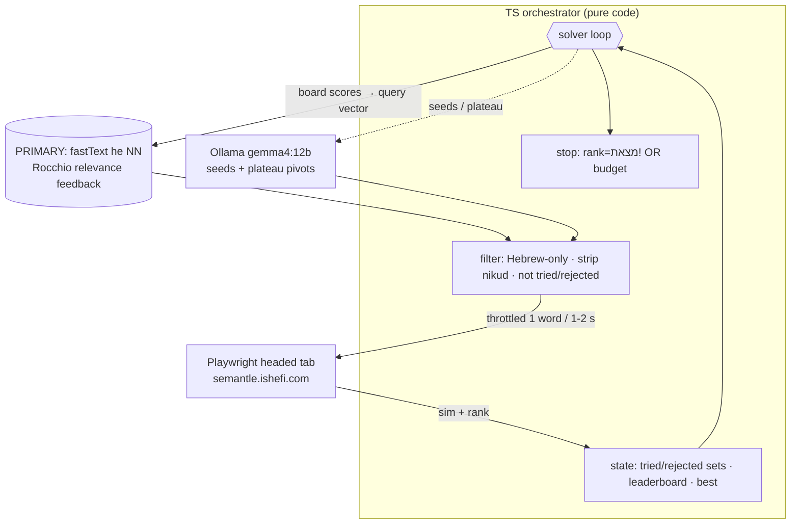

# Plan — offline autonomous Semantle solver (Playwright + Ollama + fastText)

Goal: a standalone TS script that plays the daily Hebrew Semantle (https://semantle.ishefi.com/)
end-to-end, in a **visible** browser, fully offline for the "brain": a **local Hebrew word embedding**
(fastText) does relevance-feedback hill-climbing, a **local LLM** via **Ollama** supplies seeds + plateau
pivots, and the loop / stopping / dedup are pure code. Nothing but the guesses leaves the machine.

> `CLAUDE.md` remains the manual-play runbook (used when *I* play directly, before/without the script).
> This file is the design + status of the automated solver.

## Verdict: feasible

| Piece | Status |
|---|---|
| Non-headless Playwright driving the real UI | ✅ trivial |
| Loop / stop / throttle / dedup in pure TS | ✅ trivial |
| Structured "next words" array from Ollama | ✅ `format` = JSON schema |
| Local model good at Hebrew | ✅ **validated** — see below |

The one real subtlety: an LLM's "associations" don't perfectly match the game's word2vec geometry
(it won't predict quirks like plural≫singular, or collocation-not-meaning neighbours). So the LLM is a
**candidate generator/strategist**, not an oracle. Good enough for a guided hill-climb; an optional
embedding tier (below) mirrors the game more closely.

## Model choice (tested locally, 2026-06-30)

Tested the real task — "give 12 Hebrew words near מנעול", schema-constrained JSON — against installed models:

- **`gemma4:12b` — recommended.** Strong, relevant Hebrew (מפתח/דלת/סוגר/קליפס/מחסום/שומר/סגירה…),
  honors the JSON schema, **~2 s warm** per call. It is a *reasoning* model: `think:true` yields better
  associations but needs a larger `num_predict` budget; `think:false` is fast and "good enough" because
  the code filters invalid words. Cold start ~25–55 s (one-time).
- `gemma4:e4b` — usable fast/small fallback (מנגנון/תיבה/משקוף/צירים/מגירה) but noisier
  (junk like כאסן/הוק/פדל), more code-side filtering needed.
- Skip for this role: coder models (`devstral`, `deepseek-coder`), `deepseek-ocr`, `llama3.2-vision`,
  and the weak-Hebrew small ones (`phi4-mini`, `llama3.2:3b`). `translategemma:12b`/`ornith:9b` optional
  to A/B, but `gemma4:12b` already wins.
- **Nothing else needed for the LLM tier.** Only the optional embedding tier wants more: `nomic-embed-text`
  is English-centric/text-level — for that tier add Hebrew **fastText** (`cc.he.300`, a static vector file,
  not an Ollama model — closest analogue to the game) or pull **`bge-m3`** (multilingual embedding on Ollama).

## Architecture



Both tiers are now built. The embedding is the primary candidate engine; the LLM supplies the broad-sweep
seeds and plateau pivots, and a full LLM-only fallback when `data/` is absent (`EMBEDDING=false`).

## Strategy tiers (build order)

1. **MVP — LLM-only.** ✅ BUILT. Seed broad sweep → each round feed leaderboard + tried list to
   `gemma4:12b` → words → filter/dedup → guess → repeat. **Solved #1590 in 194 guesses.**
2. **Upgrade — embedding-driven + LLM assist.** ✅ BUILT. fastText relevance-feedback NN for the bulk of
   candidates; LLM for seeds + plateau pivots. Closest to the game's mechanic. Climbs to the answer's
   neighbourhood much faster, but needs tuning to *land* the answer (see Session log).
3. **Pure embedding (Rocchio).** Available via `EMBEDDING=true` + no plateau LLM (not the default).

The model's *system prompt* encodes the same heuristics as `CLAUDE.md` §5 (track rank not sim; try
plural+singular; avoid hypernyms; pivot frame on plateau).

## Components / file map

```
sm/
  package.json        tsconfig.json   .gitignore
  scripts/
    build-vectors.ts  # one-time: stream fastText he, cache top-100k unit vectors -> data/
    test-embedding.ts # offline sanity check of NN / Rocchio quality
  src/
    config.ts         # env-tunable settings (model, throttle, headless, embedding, budgets)
    types.ts          # GuessResult, Rank, BoardEntry, CandidateContext
    browser.ts        # Playwright: openGame(), guess(page,word), readCalibration()
    ollama.ts         # generateCandidates() via /api/chat (think:true) + thinking-trace harvest
    embedding.ts      # load vectors, cosine NN, rocchioQuery(), baseForm(), embeddingCandidates()
    strategy.ts       # STARTER_POOL, shuffle(), prompts, candidate cleaning/dedup
    solver.ts         # main loop: embedding-primary + LLM pivots, stop/dedup  (entry point)
  data/               # he-words.json + he-vecs.f32 (gitignored, ~120MB, built by build-vectors)
  CLAUDE.md  README.md  PLAN.md
```

Setup once: `npm install && npx playwright install chromium && npm run build:vectors`
Run: `npm start`
Tunables via env: `MODEL`, `EMBEDDING`, `HEADLESS`, `THROTTLE_MS`, `BATCH`, `MAX_GUESSES`, `TEMP`,
`OLLAMA_URL`, and for the vector cache `VEC_N` / `VEC_MAX_LINES`.

## Risks & mitigations

- Weak/uneven Hebrew → `gemma4:12b` validated; filter junk in code; game-reject → `rejected` set.
- LLM ↔ game geometry mismatch → plateau-pivot prompt; optional embedding tier.
- Hallucinated/invalid words → Hebrew-only regex + strip nikud + single-token; rejects cost nothing.
- Repeats → authoritative `tried`/`rejected` sets, hard-filtered before guessing.
- Politeness/rate-limit → keep throttle (each new word = one real `GET /api/distance`).
- Stuck/no candidates → fallback diversity probes; `MAX_GUESSES` budget then report best.
- Selector drift → all DOM access isolated in `browser.ts`.

## Status

- [x] Plan + model validation
- [x] Scaffold (package.json, tsconfig, config, types) — typecheck clean
- [x] browser.ts (Playwright driver) — smoke-tested: מים→24.86(far), מנעול→100(FOUND)
- [x] ollama.ts (candidate gen) — JSON parsed, unknown words filtered
- [x] strategy.ts (seeds, prompts, cleaning)
- [x] solver.ts (loop) — MVP runnable & verified end-to-end
- [x] simplified to a single always-reasoning flow (`think:true`, no toggle)
- [x] **FIXED empty-candidates bug** — harvest words from the `thinking` trace (see log below)
- [x] LLM-only solved #1590 in **194 guesses** (headed)
- [x] **Phase 2 — embedding tier BUILT** (`scripts/build-vectors.ts`, `src/embedding.ts`, wired into solver)
- [x] embedding validated offline: ranks the answer #5 from the plateau the LLM took ~120 guesses to escape
- [x] **inflection de-noise = MMR diversity** (`embeddingCandidates`, `DIVERSITY` knob) — rejects
  candidates too cosine-close to ones already chosen; collapses inflection floods, keeps batches varied.
- [x] **sharper functional pivot prompt** (`strategy.ts`) — on plateau asks for the OBJECT the hot words
  LOCK/SECURE/CLOSE/CONTROL/are PART OF (the #3 "micro-pivot").
- [x] **Decisive finding (see log):** from the controls/switch stall cluster, מנעול is **NN-unreachable
  (>30)** in our fastText — so embedding tuning (diversity, rank-weighting) CANNOT close from there; the
  LLM pivot is the only bridge. ⇒ **#2 (top-rank weighting) deprioritized — proven moot for the trap.**
- [ ] **NEXT:** confirm combined run (MMR + sharper pivot) solves; if the LLM still doesn't name מנעול
  often enough, feed the pivot a tiny explicit "candidate object" instruction, or down-weight a hot word
  once its own NN region is exhausted (escape the trap).
- [ ] persistent `cache.json`; evaluation harness over multiple days (median guesses; LLM-only vs hybrid)

## Run

The model always reasons before answering (`think:true` hardcoded in `ollama.ts`). The embedding is the
primary candidate engine when `data/` exists; otherwise it's LLM-only.

```bash
npm install && npx playwright install chromium
npm run build:vectors                          # one-time: build data/ (the Hebrew vectors)
npm start                                      # headed, watch it play
# variants:
HEADLESS=true MAX_GUESSES=160 npm start         # quick capped check
EMBEDDING=false npm start                       # force LLM-only (no embedding)
MODEL=gemma4:e4b THROTTLE_MS=1500 npm start     # smaller/faster model
```

## Build notes / integration gotchas (already handled)

- **esbuild `__name` in `page.evaluate`.** tsx/esbuild injects a `__name` helper into functions, which
  is undefined in the browser → `ReferenceError`. Fix: the complex `guess` logic is sent to the page as
  a **string** (see `browser.ts`), so esbuild never rewrites it. Keep new in-page logic string-based or
  free of inner named functions.
- **jQuery submit-handler race.** Clicking `#guess-btn` before `semantle.js` binds the `#form` submit
  handler triggers a NATIVE form submit → navigation → "context destroyed". Fix: `openGame()` waits via
  `waitForFunction` until `jQuery._data(form,'events').submit` exists.
- **npm allow-scripts policy** blocks esbuild's postinstall; run `node node_modules/esbuild/install.js`
  once (already done) so `tsx` works.
- **Observed LLM drift:** with reasoning off, `gemma4:12b` wandered lock→mechanism→wheels/vehicles.
  The build now always reasons (`think:true`); remaining drift is mitigated by a stronger pivot prompt
  or the embedding tier.

## Session log / debugging (resume here)

Context: today's secret (puzzle #1590) is **מנעול** (lock); used here only to judge runs. The manual
play earlier solved it in 145 guesses (see `CLAUDE.md` log). The script must rediscover it blind.

### Empty-candidates bug — found & FIXED
- **Symptom:** first full headed run (`HEADLESS=false THROTTLE_MS=1200 MAX_GUESSES=200`) stopped after
  round 2 with "No new candidates left — stopping." It guessed the 24 seeds + 30 fallback probes, then
  died. No `[ollama]` HTTP warnings — so requests succeeded but returned **no usable words**.
- **Good news in that run:** the broad sweep already hit strong signal —
  **דלת (door) 66.01 → 966/1000** and **חלון (window) 60.43 → 682/1000** (door is rank 966, very close;
  the answer מנעול is door/building-adjacent). The machinery just failed to exploit it.
- **Root cause (confirmed by direct `/api/chat` tests):** `gemma4:12b` + `think:true` + structured
  `format` schema → the model spends the **entire** `num_predict` budget on the reasoning trace and
  returns `content: ""` with `done_reason:"length"`. Reproduced at `num_predict` 1024 (13s) **and**
  3072 (40s, 7.7k-char thinking, still empty). Raising the budget further is too slow/fragile.
- **Fix (implemented in `ollama.ts`):** when `content` is empty/unparseable, **harvest Hebrew tokens
  from `message.thinking`** via `harvestHebrew()` (capped at 30). Verified: the thinking trace for the
  door/window leaderboard yielded 18 valid new candidates (קיר/גג/מרפסת/רצפה/תקרה/מתכת/מעקה/בניין/…).
  `parseWords(content)` is still tried first, so this is a safe fallback.

### Harvest fix result
- After the fix, the full headed LLM-only run **SOLVED מנעול in 194 guesses** — but plateaued at sim 67
  for rounds 16–27 (~120 guesses) before the LLM's pivots stumbled onto lock. That inefficiency is what
  Phase 2 targets.

### Phase 2 — embedding tier (BUILT, partially tuned)
- **Data:** `npm run build:vectors` streams fastText `cc.he.300.vec.gz` (1.23 GB), keeps the top **100k**
  Hebrew words as unit-normalized float32 → `data/he-words.json` + `data/he-vecs.f32` (~120 MB, seconds;
  download aborts early). `VEC_N` controls vocab size (50k missed מקדחה; 100k covers it).
- **Engine (`src/embedding.ts`):** cosine NN + Rocchio relevance feedback
  (`q = Σ wᵢ·vec(wordᵢ)`, hot pull / cold push, rank bonus) + `baseForm()` prefix de-noise for ה/ו/ב/ל/כ/ש.
- **Offline validation (`scripts/test-embedding.ts`):** NN of מנעול = מפתחות/דלת/נעילה/מפתח/פריצה (spot on).
  Rocchio from the LLM's plateau cluster ranks **מנעול #5** in the de-noised candidates — i.e. ~5 guesses
  to break a plateau that cost the LLM ~120.
- **Live hybrid runs did NOT solve, but climb very close.** Pulled by the hottest seed (מחשב/computer 51),
  the embedding hill-climbs computer→device→install→**electrical controls/switches**, the cluster the game
  places right next to מנעול ("locking device"). Best reached:
  - headless, budget 160 → **התקן 67.31/979**, מתג 977 (2nd/3rd closest words).
  - headed, budget 250 → **לחצנים 70.89/996** (4th-closest word!), plus התקן 979, מתג 977, טיימר 929,
    לחצן 923, מפסק 849. Sim 70.89 vs the day's closest 74.12 — at the doorstep.
  Then it STALLS, churning button/install inflections (לחצן/לחצנים/מותקן/יותקן/מתקין) without the last ~3
  steps to מנעול. So the engine climbs into the answer's immediate neighbourhood reliably; the open
  problem is *landing* the final few ranks.
- **Why it stalls (two causes):**
  1. **Inflection noise** — `baseForm()` only strips clitic prefixes (ה/ו/ב/ל/כ/ש); it does NOT collapse
     מ-participles or verb conjugations, which flood the candidate list near the answer.
  2. **Proxy-geometry gap** — our fastText ≠ the game's word2vec, so words the game scores rank-977/979
     (התקן/מתג) aren't necessarily מנעול's *nearest* neighbours in our space, so the Rocchio centroid sits
     near-but-not-on the answer.

### Tuning iteration (done in this session)
- **#1 inflection de-noise → MMR diversity** (instead of risky Hebrew stemming): proper root-stemming
  needs a morphology tool, and stem-dedup is unsafe (נעילה & מנעול share root נ.ע.ל → could exclude the
  answer). Near-duplicate inflections cluster tightly in vector space, so `embeddingCandidates` now
  rejects a candidate whose cosine to an already-chosen one exceeds `DIVERSITY` (0.65). Offline: from the
  tools cluster the list is varied and **מנעול stays at #5**.
- **Decisive offline test (`scripts/test-embedding.ts`):** from the **controls/switch stall cluster**
  (לחצנים 996, התקן 979, מתג 977) **מנעול is position >30** — the NN there is all electrical
  (כפתור/מפסק/מתגים/חיישן/רכיב/כבל). So once trapped in that game-close-but-fastText-far region, NN can't
  reach the answer. ⇒ #2 (rank-weighting) won't help; the LLM must bridge.
- **#3 sharper functional pivot** (`strategy.ts`): on plateau, ask for the concrete OBJECT the hot words
  LOCK/SECURE/CLOSE/OPEN/CONTROL/are PART OF. Test (`scripts/test-pivot.ts`) from the controls cluster now
  yields **דלת (door) · שער (gate) · אבטחה (security) · שלט/שליטה** — escaping toward the lock
  neighbourhood (door's NN → lock). It didn't name מנעול in one sample, but door re-enters the hot set and
  the functional prompt is the right framing; across plateau rounds it should land.

### Puzzle rollover note
- The daily secret rolled over to **#1591** (a dog/pet-adjacent word) — so the מנעול (#1590) case can no
  longer be reproduced live; its validation is **offline-only** (and passed). A combined run on #1591
  (MMR + sharper pivot) stalled at **כלב 51.12 / rank 58** — a weak anchor; the true region (sim 60–67)
  was not found in 170 guesses. Working as designed, just a different/harder unknown puzzle.
- Takeaway: don't tune to one day's answer (overfitting). The right validation is the **multi-day eval
  harness** (below) measuring median guesses — that's the next substantive item.

### Remaining ideas if it still won't close
- Feed the pivot an explicit "name the single most likely physical object" nudge, or a couple of
  one-shot examples.
- **Escape the trap:** once a hot word's own NN region is exhausted (many cold neighbours tried),
  down-weight it in `rocchioQuery` so the centroid moves off the dead region.
- Persistent `cache.json` + multi-day eval harness (median guesses; LLM-only vs hybrid).

### Useful facts for whoever resumes
- Models live in Ollama; tested best = `gemma4:12b` (Hebrew good, JSON ok). `gemma4:e4b` lighter/noisier.
- Each new guess = one real `GET /api/distance`; keep the throttle.
- `tsx` works only after `node node_modules/esbuild/install.js` ran once (allow-scripts policy).
- All temp/debug bodies were written under the session scratchpad, not the repo.
- `CLAUDE.md` is the manual-play runbook (unchanged) — use it to play by hand while the script matures.
