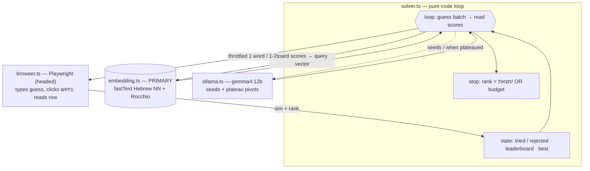

# Semantle-Hebrew autonomous solver

Plays the daily Hebrew **Semantle** (סמנטעל, https://semantle.ishefi.com/) on its own. Built for
educational purposes — exploring word2vec hill-climbing and LLM-guided search; please keep the
throttle in place if you run it, to stay a polite client of someone else's site.

There are two ways it plays, and this README explains how they work for a human reader:

1. **Manual** — Claude plays directly through browser tools, guided by [`CLAUDE.md`](./CLAUDE.md)
   (just say *"play the daily game"*).
2. **Automated script** — a standalone TypeScript program: a **local** Hebrew embedding + a **local**
   LLM (via Ollama) drive a headed Playwright browser. Design & status in [`PLAN.md`](./PLAN.md).

The "brain" is fully offline — only the guesses themselves ever leave the machine.

## The game

You guess a Hebrew word; the server returns a **cosine-similarity score (0–100)** to a hidden daily
"secret" word in a **word2vec** embedding, plus a **rank** (`N/1000`, where higher = closer; `מצאת!` =
found). You keep guessing, using each score as feedback, until you hit the secret. It is essentially a
**hill-climbing search over a semantic space** with a one-number reward per step.

**Networking:** the game is **online** — each *new* word is one `GET /api/distance?word=…`; the server
holds the secret and the model. Repeats are served from a client cache. A full solve is ~100–200 live
calls, which is why the solver **throttles** itself (≥ ~1–2 s/guess) to stay a polite client.

## The automated script — architecture



| File | Role |
|------|------|
| `browser.ts` | Playwright driver — opens the game, fills `#guess`, clicks the **ניחוש** button, scrapes the result row. Drives the real UI so you can watch. |
| `ollama.ts` | Calls a local model (`gemma4:12b`, reasoning on) with a JSON schema; **harvests candidate words from the model's `thinking` trace** (it over-thinks and returns empty `content` otherwise). |
| `embedding.ts` | Loads local Hebrew fastText vectors; cosine **nearest-neighbour** + **Rocchio relevance feedback**; the primary candidate engine. |
| `strategy.ts` | Broad-sweep seed words, the LLM system prompt (encodes the heuristics below), Hebrew-only cleaning + dedup. |
| `solver.ts` | The loop: throttle, `tried`/`rejected` sets, plateau detection, win/budget stop. |
| `scripts/build-vectors.ts` | One-time: streams fastText `cc.he.300` and caches the top-100k unit vectors to `data/`. |

## The candidate engine (the interesting part)

The LLM is a great **idea generator** but a poor **distance estimator** — and the game is a distance
problem. So the embedding does the climbing and the LLM does the creative leaps:

- **Embedding (primary).** Every guess is evidence. Build a query vector that points at the hot region
  and away from the cold one, then return its nearest unseen neighbours:
  ```text
  q = Σ wᵢ · vec(wordᵢ)     wᵢ = +big if hot (high sim / in top-1000, scaled by rank)
                                  −small if cold (far)
  next = nearestNeighbours(q) \ alreadyTried
  ```
  This optimises the *same metric the game rewards*, so it won't drift into thematically-related-but-
  distant words. A `baseForm()` step collapses clitic-prefixed inflections (המנעול/וברגים → base).
- **LLM (seeds + pivots).** Supplies the initial broad sweep and, when the embedding plateaus, a creative
  reframe ("what *secures* a door? → a lock") that injects a new region for the embedding to exploit.

### Heuristics (shared by the manual play and the LLM prompt)

| Heuristic | Why |
|---|---|
| **Track rank, not just similarity** | `N/1000` (higher = closer) is the sharp signal near the top. |
| **Calibrate to the day** | The header gives today's closest / 10th / 1000th scores, so "57" is hot some days, cold others. |
| **Exploit morphology** | Very number-sensitive: a plural can score 40+ above its singular (ברגים 67 vs בורג 25). |
| **Avoid hypernyms** | Category words ("tools", "device") are usually cold even when their members are hot — it keys on collocation, not meaning. |
| **Pivot on plateaus** | The hot cluster is often the *context* around the answer, not its category — reframe to parts / place / action / the device they form. |

## Results so far (puzzle #1590, secret = **מנעול** "lock")

| Player | Guesses | Notes |
|---|---|---|
| Claude, manual (CLAUDE.md) | 145 | sweep → tools/fasteners → device → lock |
| Script, LLM-only | **194** ✅ | solved, but plateaued ~120 guesses at sim 67 before pivoting |
| Script, hybrid (embedding) | climbs to rank **996**, then stalls | reaches לחצנים 70.89/996 (4th-closest word), התקן 979, מתג 977 — at the doorstep, but doesn't yet *land* the answer |

The embedding's premise is proven offline: from the exact cluster where the LLM burned ~120 guesses, the
embedding ranks **מנעול #5** in its next candidates. The remaining gap to a reliable closer is **(a)**
Hebrew inflection noise near the answer (מ-participles / verb conjugations the de-noiser doesn't yet
collapse) and **(b)** the proxy-geometry gap (our fastText ≠ the game's exact word2vec). Both are the
current tuning targets — see `PLAN.md` → *Session log → Next actions*.

## Run it

```bash
npm install && npx playwright install chromium
npm run build:vectors      # one-time: download/cache the Hebrew vectors into data/
npm start                  # headed — watch it play today's puzzle
```
Tunables (env): `MODEL`, `EMBEDDING` (false = LLM-only), `HEADLESS`, `THROTTLE_MS`, `BATCH`,
`MAX_GUESSES`, `TEMP`, `OLLAMA_URL`.

## Files
- **`CLAUDE.md`** — the manual-play runbook Claude follows (zero extra instructions). Self-updating log.
- **`PLAN.md`** — the script's design, status, model tests, and a resumable debugging log.
- **`README.md`** — this human-facing overview.
- **`src/` · `scripts/`** — the solver. **`data/`** — the (gitignored) local vector cache.
